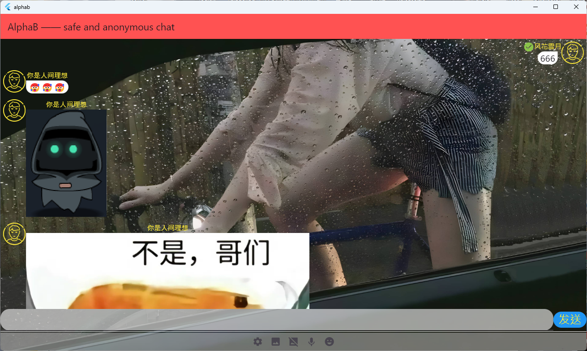
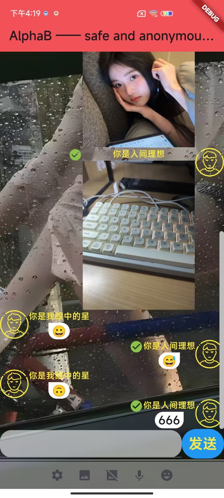

# alphab-client（开发中）

### 对safe-chat项目进行重构

服务端仓库 [jeanhua/alphab-server: 匿名加密聊天程序(服务器) (github.com)](https://github.com/jeanhua/alphab-server)

一>[消息文档](./Specs.md)

> 美化UI
>
> 添加气泡效果
>
> 添加照片、语音、闪照 等功能

### 电脑端

### 手机端

